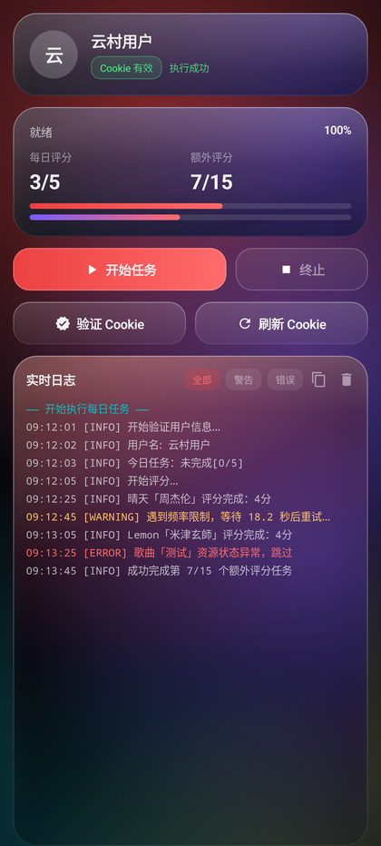
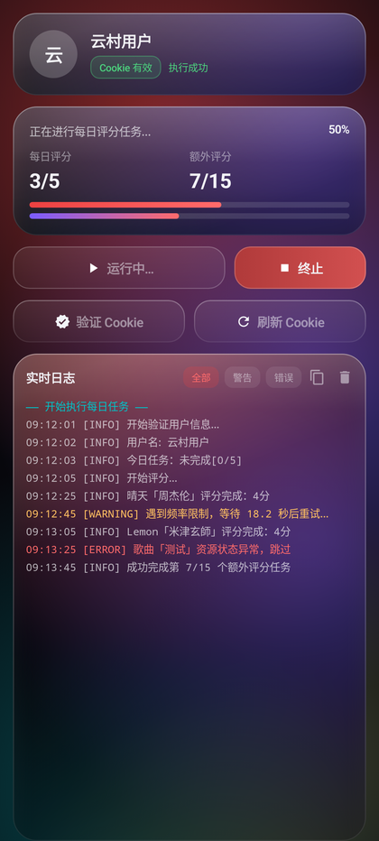
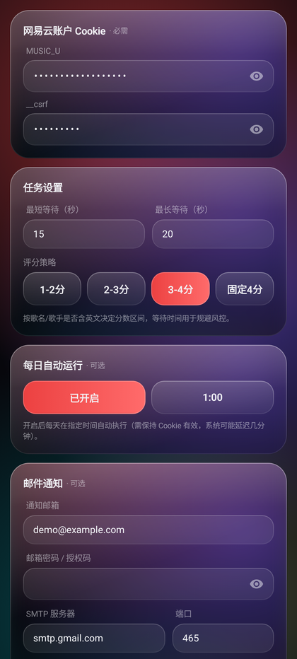
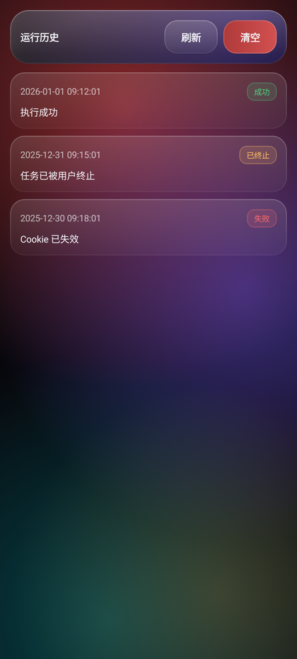
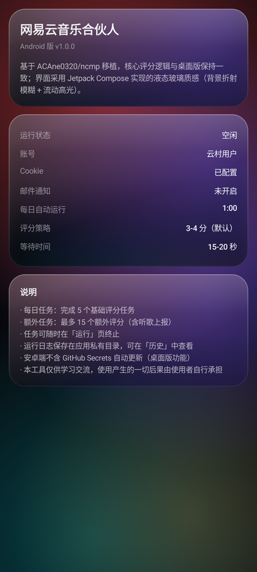

# ncmp-android · 网易云音乐合伙人（安卓版）

> 本项目是 [ACAne0320/ncmp](https://github.com/ACAne0320/ncmp) 的 **Android 移植版**，
> 采用 **原生 Kotlin + Jetpack Compose** 实现，界面为**液态玻璃（Liquid Glass）**风格：
> 真实背景折射模糊、流动彩色光斑、玻璃描边与高光。

## 界面预览

> 下图为 Compose 预览在 JVM 上真实渲染的结果（`gradle updateDebugScreenshotTest` 生成），
> 非设计稿；实机在 Android 12+ 上还会叠加 GPU 背景模糊。

| 运行控制 | 运行中 | 配置 |
| --- | --- | --- |
|  |  |  |

| 运行历史 | 关于 |
| --- | --- |
|  |  |

## 功能

- **Cookie 校验**：一键验证 MUSIC_U / __csrf 并显示昵称
- **每日任务**：自动完成 5 个基础评分任务
- **额外任务**：自动完成最多 15 个额外评分（含听歌记录上报）
- **实时日志**：SSE 式的运行日志流（等级着色、按级别过滤、一键复制）
- **实时进度**：每日/额外任务进度条与总进度百分比
- **手动终止**：评分等待期间可随时中断任务
- **运行历史**：每次运行的结果与完整日志保存在应用私有目录，可查看/删除
- **邮件通知**：Cookie 失效或任务失败时发送提醒邮件（内置极简 SMTP 客户端，支持 SSL/STARTTLS）
- **Cookie 自动刷新**：手机号 + 密码（或 MD5 密码）登录换取新 Cookie，保存在本机
- **每日定时执行**：WorkManager 定时任务，到点自动跑并推送通知
- **液态玻璃界面**：Compose 自绘玻璃面板，Android 12+ 使用 GPU 背景模糊

## 与桌面版的差异

| 能力 | 桌面版 | 安卓版 |
| --- | --- | --- |
| 评分核心逻辑 | Python | Kotlin（已通过一致性测试，加密结果逐字节相同） |
| 界面 | Tauri + Web | Jetpack Compose 原生 |
| Cookie 自动刷新 | 登录 + 更新 GitHub Secrets | 登录 + 保存到本机（安卓端无 NaCl sealed box，故不含 GitHub Secrets 更新） |
| 定时执行 | GitHub Actions / cron | WorkManager（应用内定时） |

## 液态玻璃的实现方式

1. **流动背景**（`LiquidBackground`）：Canvas 绘制 4 组缓慢漂移的径向渐变光斑（网易红 / 紫罗兰 / 青 / 琥珀）
2. **真实背景模糊**（`GlassSurface`）：把**同一份背景**按卡片位置偏移后 `Modifier.blur()` 再裁剪到卡片形状，
   因此卡片内看到的是"背后内容的模糊版本"，而不是半透明色块（背景状态由 `LiquidState` 统一持有，
   两份拷贝像素级对齐）
3. **玻璃质感层**：顶部高光渐变 + 渐变描边 + 圆角 26dp，形成厚度感
4. Android 12（API 31）以下 `blur` 自动降级为半透明填充，界面依旧可用

## 构建

### 环境要求

| 组件 | 版本 | 说明 |
| --- | --- | --- |
| JDK | 17 或 21 | 需设置 `JAVA_HOME` |
| Android SDK | Platform 34 + Build-Tools 34.0.0 | 通过 Android Studio 或 `sdkmanager` 安装 |
| Gradle | 8.7+（推荐 8.9） | 或用 `gradlew`（Android Studio 自带） |

`local.properties` 需指向本机 SDK（Android Studio 会自动生成）：

```properties
sdk.dir=C\:\\Users\\<user>\\AppData\\Local\\Android\\Sdk
```

### 命令行构建

```bash
# Debug 包（可直接安装）
gradle assembleDebug

# Release 包（默认使用 debug 签名，便于自行安装测试）
gradle assembleRelease

# 运行一致性单元测试
gradle testDebugUnitTest
```

产物路径：

- `app/build/outputs/apk/debug/app-debug.apk`
- `app/build/outputs/apk/release/app-release.apk`

> 正式发布请在 `app/build.gradle.kts` 中把 `signingConfig` 替换为自有签名。

### 依赖镜像

`settings.gradle.kts` 中默认优先使用阿里云 Maven 镜像（国内加速）；
在其它地区构建时可删除前两个 `maven(...)` 行。

## 验证情况

- `gradle assembleDebug` / `assembleRelease` 均构建成功
- 单元测试 10/10 通过，其中 `CryptoParityTest` 用桌面版 Python 生成的参考值校验：
  - `params`（双重 AES-CBC）逐字节一致
  - `encSecKey`（RSA 无填充）逐字节一致
  - 评分策略 6 种组合与桌面版一致

## 目录结构

```
app/src/main/java/com/ncmp/partner/
├── MainActivity.kt            # 入口（edge-to-edge）
├── NcmpApp.kt                 # Application：通知渠道 + 定时任务校正
├── core/
│   ├── NcmpCrypto.kt          # weapi 加密（AES-CBC ×2 + RSA）
│   ├── NcmpApi.kt             # 接口客户端（任务/评分/听歌上报）
│   ├── ScorePolicy.kt         # 评分策略
│   ├── TaskRunner.kt          # 任务流程编排（含终止/进度/日志）
│   ├── CookieRefresher.kt     # 手机号登录刷新 Cookie
│   ├── Cancellable.kt         # 可中断等待
│   └── Models.kt              # 数据模型与事件
├── data/
│   ├── ConfigStore.kt         # 配置读写（config.json）
│   └── HistoryStore.kt        # 运行历史与日志
├── notify/
│   ├── MailSender.kt          # 极简 SMTP（SSL / STARTTLS）
│   └── Notifier.kt            # 本地通知
├── work/
│   ├── DailyTaskWorker.kt     # 定时任务执行体
│   ├── DailyTaskScheduler.kt  # 定时任务登记
│   └── BootReceiver.kt        # 开机恢复
├── ui/
│   ├── NcmpRoot.kt            # 顶部栏 / 底部玻璃导航 / 页面切换
│   ├── theme/Theme.kt         # 配色与字体
│   ├── glass/Glass.kt         # 液态玻璃设计系统
│   ├── components/Widgets.kt  # 玻璃按钮/输入框/进度条等
│   └── screens/               # 运行 / 配置 / 历史 / 关于
└── vm/NcmpViewModel.kt        # 状态与业务编排
```

## 声明

- 本项目仅供学习交流使用，不得用于商业用途
- 使用本程序产生的一切后果由使用者自行承担
- 上游项目：[ACAne0320/ncmp](https://github.com/ACAne0320/ncmp)
